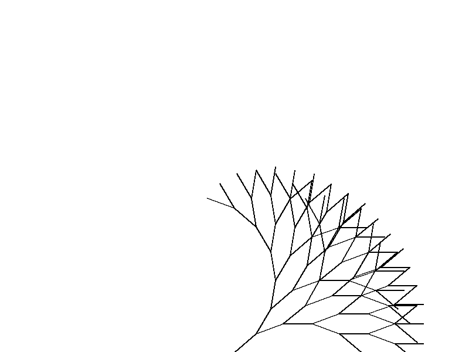

# Work Showcase: Physics Demonstration
In this demonstration I'll conduct some relatively simple physics using different Python packages. Numpy and Math to conduct mathematical functions, Matplotlib, IPython, and Pillow to visualize data, and Glob, OS, and Tkinter to improve user interface. The physics demonstrated in these files are relatively fundamental and are effective for reiterating real-world experiences we witness and expressing different coding techniques.

## Projectile Motion
Projectile motion is a straightforward concept that we witness in a variety of scenarios. In this code I have modeled some kinematic equations using Numpy, graphed and saved them as a .gif files using Matplotlib and Matplotlib's Animation sub-package, then displayed the gif using IPython, replaying it using Glob and OS. Having a repetitious image to view the response to the user's inputs I feel is an important addition as visual aids are key for facilitating abstract discussions.

## Optical Lens
Optics is a component of physics that is often overlooked. The daily, moment-to-moment usage we get out of tools like eyeglasses, glass screens, mirrors, etc. is so important it often feels second nature. However, understanding the impact of components like curvature, focal length, and image length is of the utmost importance. In this code I have conducted the math using built-in python logic, used Numpy arrays for memory, and saved and displayed the end product as a .png file using Matplotlib.

## Solar System
Examining the nuances of the solar system's orbital physics is essential, as it unravels the fundamental principles that govern celestial motions. In this code I have modeled the positions of the planets using the Math package, used a list as memory for the positions of the bodies, created a function to model the influence of the bodies on one another at any given instant, and plotted/saved the visual aid using Matplotlib and Matplotlib's Animation.

## Fractal Expansion
Exploring the intricacies of fractals asks for inquisition, as it unveils the fundamental principles underlying self-replication and infinite complexity in mathematical patterns. In this code I have created a pop-up user interface using Tkinter, created different modeling widgets for this interface, made a drawing function using Python Imaging Library (PIL) with some help from Math, then saved and displayed the resultant image using IPython.

